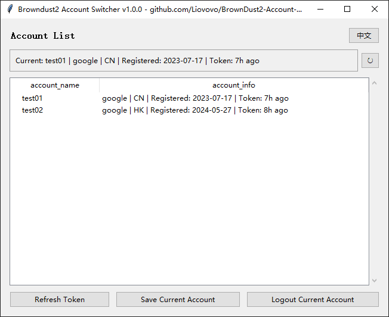

# Browndust2 Account Switcher

Manage and switch between multiple Browndust2 game accounts on Windows.



## Download

Download the latest executable from [Releases](https://github.com/Liovovo/BrownDust2-Account-Switcher/releases)

Or run from source:
```bash
pip install -r requirements.txt
python browndust2_account_switcher.py
```

## Usage

1. **Refresh Token** - Update token for the current account
2. **Save Current Account** - Save the currently logged-in account
3. **Logout Current Account** - Clear current account from registry
4. **Load Account** - Double-click or right-click to load/rename/delete

## Important

- **Place in a dedicated folder** - creates `accounts.json` in the same directory
- Close the game before switching accounts
- `accounts.json` contains sensitive data - do not share

## Disclaimer

This tool is provided "as is" without warranty. Use at your own risk. The developers are not responsible for any account issues, data loss, or violations of game terms of service that may result from using this tool.

## License

MIT
